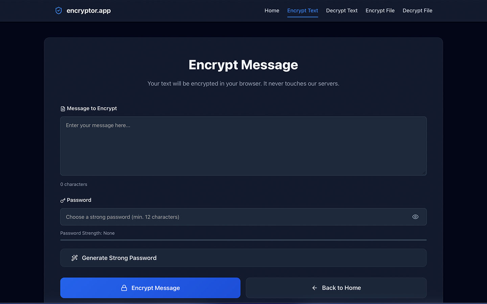
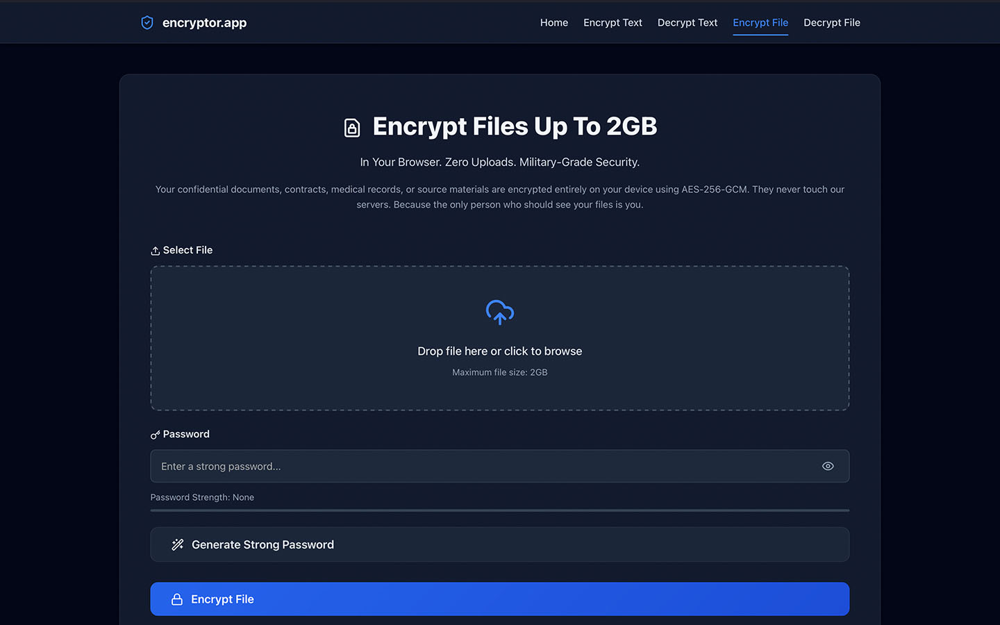
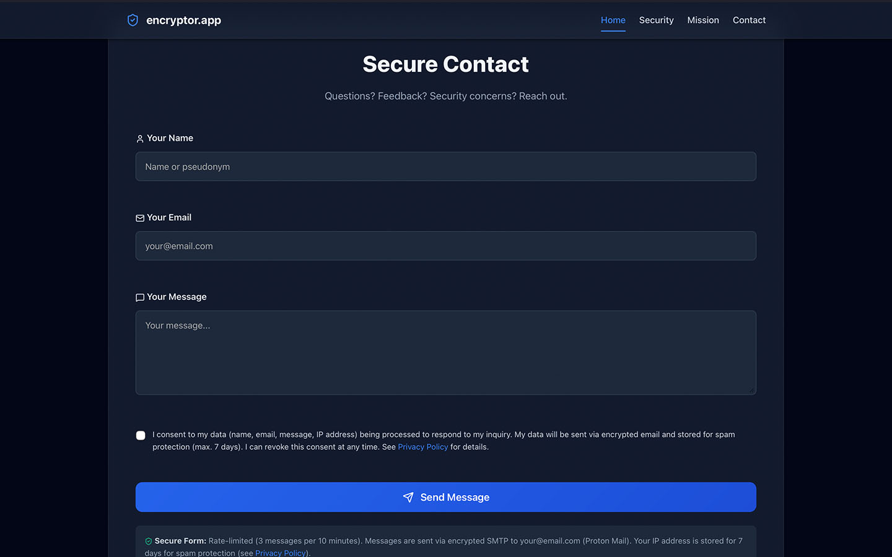

# Encryptor.app

**Client-Side Encryption for Messages and Files up to 2GB**

Built with forensic-grade security by **George A. Rauscher** (25+ years IT security experience)

**Live Demo:** [https://encryptor.app](https://encryptor.app)

---

## Features

### Zero-Knowledge Encryption
- AES-256-GCM (military-grade encryption)
- All processing happens in your browser
- No data ever touches our servers
- No registration, no tracking, no logs

### File Encryption (up to 2GB)
- Drag & drop interface
- Handles large files efficiently
- Encrypted files include password hint
- Original filename preserved in metadata

### Text Encryption
- Quick message encryption
- Copy encrypted text with one click
- Perfect for secure communications
- No character limits

### Advanced Security
- PBKDF2 key derivation (100,000 iterations)
- Random salt for each encryption
- Authentication tags prevent tampering
- SHA-256 fingerprints for verification
- **Quantum-resistant password generation** (24 chars, ~158 bits entropy)

### Modern Tech Stack
- Pure client-side JavaScript (Web Crypto API)
- Progressive Web App ready
- Works offline after first load
- No dependencies, no tracking

---

## Quick Start

### Online
Visit [encryptor.app](https://encryptor.app) and start encrypting immediately.

### Self-Hosted
```bash
git clone https://github.com/georgerauscher/encryptor-app.git
cd encryptor.app
```

Open `index.html` in any modern browser. That's it! No build process required.

---

## How It Works

### Encryption Process
1. **Key Derivation**: Your password is processed through PBKDF2 (100,000 iterations)
2. **Random Salt**: A unique salt is generated for each encryption
3. **AES-256-GCM**: Military-grade encryption with authentication
4. **Metadata**: Original filename and fingerprints are embedded
5. **Download**: Encrypted file downloads automatically (.encrypted extension)

### Decryption Process
1. **Upload**: Select your encrypted file
2. **Password**: Enter the password used for encryption
3. **Verification**: Authentication tag ensures file wasn't tampered with
4. **Restore**: Original file is restored with correct filename

---

## Security Features

### What Makes This Secure?

**Client-Side Only**
- All encryption happens in your browser
- No server-side processing
- No data transmission
- No logs, no tracking

**Strong Cryptography**
- AES-256-GCM (NIST approved)
- PBKDF2 with 100,000 iterations
- Random salt per encryption
- Authentication tags (AEAD)
- **Quantum-resistant passwords:** 24 characters, 94-character charset (~158 bits entropy, ~79 bits post-quantum)

**No Dependencies**
- Uses native Web Crypto API
- No external libraries
- No tracking scripts
- Lucide icons hosted locally (zero CDN, 100% privacy)

**Privacy by Design**
- No registration required
- No email collection
- No cookies
- No analytics

---

## Use Cases

**Business Communications**
Send confidential documents securely without enterprise email systems.

**Healthcare Professionals**
Share patient data while maintaining GDPR/HIPAA compliance.

**Developers**
Protect API keys, credentials, and sensitive configuration files.

**Privacy Advocates**
Communicate without trusting third-party services.

**Personal Security**
Encrypt personal documents before cloud storage.

---

## Technical Specifications

### Encryption
- **Algorithm**: AES-256-GCM (Authenticated Encryption)
- **Key Derivation**: PBKDF2-SHA-256
- **Iterations**: 600,000 (OWASP 2023 recommendation)
- **Salt**: 16 bytes (cryptographically random)
- **IV**: 12 bytes (cryptographically random)
- **Tag**: 128 bits (authentication)

### Browser Requirements
- Chrome 80+
- Firefox 75+
- Safari 14+
- Edge 80+
- Any browser with Web Crypto API support

### File Size Limits
- **Maximum**: 2GB per file
- **Recommended**: Up to 500MB for best performance
- **Large Files**: 500MB-2GB (may take longer on slower devices)

---

## File Format

Encrypted files use this structure:

```
[Magic Bytes: "ENC1"]
[Salt: 16 bytes]
[IV: 12 bytes]
[Hint Length: 2 bytes]
[Hint: UTF-8 string]
[Filename Length: 2 bytes]
[Filename: UTF-8 string]
[Fingerprint Length: 2 bytes]
[Fingerprint: UTF-8 string]
[Encrypted Data + Auth Tag]
```

This format ensures:
- Version compatibility
- Tamper detection
- Metadata preservation
- Cross-platform support

---

## Attribution

**Built by:** George A. Rauscher  
**Company:** intelligent piXel GmbH
International Institute of Forensic Expertise (IIFE)  
**Location:** Starnberg, Germany  
**Experience:** 25+ years in IT security and digital forensics

If you use this project, please keep the footer attribution intact. It helps others discover this tool and supports continued development.

---

## License

MIT License - See [LICENSE](LICENSE) file for details.

Copyright (c) 2025 George A. Rauscher
intelligent piXel GmbH
International Institute of Forensic Expertise (IIFE)

---

## Bug Reports & Feature Requests

Found a bug or have a feature request? Please open an issue on GitHub.

**Security vulnerabilities:** Please report privately to george@rauscher.xyz

---

## Privacy & GDPR

This application is GDPR compliant by design:
- No personal data collection
- No cookies
- No tracking
- No server-side processing
- All data stays in your browser

Lucide icons hosted locally (zero CDN, 100% privacy)

---

## Legal

**Responsible Party:**  
George A. Rauscher  
intelligent piXel GmbH
International Institute of Forensic Expertise (IIFE)  
Starnberg, Germany

**Email:** george@rauscher.xyz

For full legal information, see the Imprint and Privacy Policy pages.

---

## Screenshots

### Text Encryption


### File Encryption


### Contact Form


---

## Disclaimer & Customization

**IMPORTANT:** If you self-host this application, you MUST:

1. **Replace all placeholder data** in `imprint.php` and `privacy.php` with your own legal information
2. **Adapt the privacy policy** to your jurisdiction (EU GDPR, US CCPA, etc.)
3. **Add your local data protection authority** contact information
4. **Customize SMTP settings** for the contact form
5. **Review and update all legal sections** according to your country's laws

**Liability:** The original author (George A. Rauscher) is NOT liable for any legal issues arising from:
- Incorrect or incomplete legal information in self-hosted versions
- Non-compliance with local data protection laws
- Misuse of the software
- Failure to customize legal documents

**Consultation:** We strongly recommend consulting a lawyer familiar with your jurisdiction's data protection and privacy laws before deploying this publicly.

---

## Roadmap

- [ ] Multi-language support (German, French, Spanish)
- [ ] Progressive Web App (PWA) with offline support
- [ ] Mobile app versions (iOS/Android)
- [ ] Browser extension
- [ ] Advanced key management
- [ ] Team sharing features (still client-side!)

---

## Why Open Source?

**Transparency** is essential for security tools. Open source allows:
- Independent security audits
- Community contributions
- Trust through verification
- Educational purposes

**Cryptography should never be a black box.**

---

## Contributing

Contributions are welcome! Please:
1. Fork the repository
2. Create a feature branch
3. Make your changes
4. Test thoroughly
5. Submit a pull request

**Code style:**
- Clean, readable code
- No external dependencies (except Web Crypto API)
- Maintain security-first approach
- Comment complex logic

---

## Star This Project

If you find this useful, please star the repository! It helps others discover this tool.

---

**Made by forensic experts who understand security.**

**No tracking. No data collection. No compromises.**

